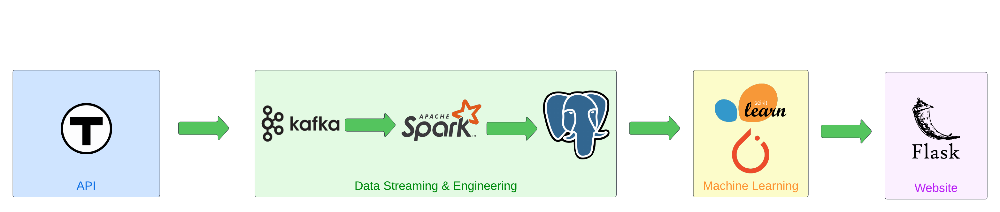

# MBTA Data Streaming and Prediction Project

## Project Introduction

As a regular user of the MBTA transit system during my time at Harvard, particularly relying on the red line at Harvard Station for quick commutes to MIT, I recognized the importance of accurate transit predictions. While the MBTA provides scheduled predictions, there is an opportunity to create our own real-time predictions. This project aims to encompass a comprehensive full-stack Machine Learning engineering workflow. From data engineering and machine learning to DevOps, MLOps, and web development, the project's goal is to develop a real-time streaming dashboard that predicts whether a transit line will arrive on time or experience delays.

## Project Overview

The primary objective of the MBTA Data Streaming and Prediction Project is to leverage data science and engineering to enhance transit prediction accuracy. By combining real-time data streaming and predictive modeling, we aim to create a system that provides users with valuable insights into transit timings. The project involves several key components:

1. **Real-Time Data Streaming**: Gathering real-time data from the MBTA transit system, including information on train schedules, delays, and historical performance.

2. **Data Engineering**: Processing and transforming the collected data to prepare it for use in predictive modeling.

3. **Predictive Modeling**: Developing machine learning models that analyze historical and real-time data to predict whether a transit line will be on time or experience delays.

4. **Real-Time Predicting**: Implementing a streaming pipeline that continuously updates predictions as new data arrives.

5. **Dashboard Development**: Creating a user-friendly web dashboard that displays real-time transit predictions and provides insights into transit line performance.

6. **DevOps and MLOps**: Establishing an effective DevOps workflow to automate deployment and monitoring of the streaming pipeline and models.

## Project Goals

- Develop accurate predictive models for MBTA transit line timings, integrating both historical and real-time data.
- Implement a data streaming pipeline that continuously updates predictions as new data becomes available.
- Create an interactive web dashboard that enables users to monitor real-time transit predictions.
- Apply DevOps and MLOps practices to ensure automated deployment, scaling, and monitoring of the entire system.

## Technologies Used

- Python
- PySpark
- Kafka
- Machine Learning Libraries (e.g., scikit-learn, TensorFlow)
- Flask (for web dashboard)
- Docker
- GitHub Actions (for CI/CD)

## Project Impact

The MBTA Data Streaming and Prediction Project aims to provide commuters with reliable and accurate transit predictions, enhancing their daily travel experience. By leveraging real-time data and predictive modeling, we hope to contribute to improved transit planning and decision-making for MBTA users.

## Getting Started

To get started with this project, follow the instructions in the project documentation to set up the required environment, run the data streaming pipeline, deploy the predictive models, and access the real-time dashboard.

## Feedback

Feedback to this project is always welcome. If you'd like to contribute, please refer to the contribution guidelines in the repository. For feedback or questions, feel free to reach out to the project maintainers.
