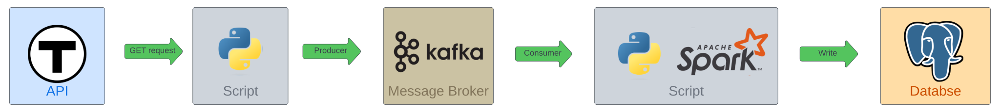

# Data Streaming

## Overview

This README provides a brief overview of the data streaming process used to fetch and store data from the MBTA API. The process involves constantly querying the MBTA API, capturing the JSON response, and then streaming this data to a Kafka topic . Subsequently, a consumer application listens to this Kafka topic and writes the data to a PostgreSQL database.

## Data Streaming Workflow

### 1. Constant Data Fetching

The data streaming process starts by frequently querying the MBTA API for scheduling information. This is accomplished using a script that makes HTTP requests to the MBTA API endpoints, supplying the required API credentials and parameters. The data fetched from the API is in JSON format.

### 2. Kafka Producer

Once the JSON data is retrieved from the MBTA API, it is sent to a Kafka topic. A Kafka producer is responsible for publishing this data to the topic. The Kafka producer can be configured to handle various aspects such as message serialization, error handling, and partitioning strategies.

### 3. Kafka Topic

The topic acts as a buffer for the incoming data. Kafka topics allow for the decoupling of data producers and consumers, ensuring that data is available for consumption even if the consumer is temporarily offline.

### 4. Kafka Consumer

A Kafka consumer application is responsible for listening to the kafka topic and consuming the data as it arrives. This consumer application can be implemented to run continuously or on a schedule, depending on the desired data freshness. Upon receiving data from Kafka, the consumer processes it and prepares it for storage.

### 5. PostgreSQL Database

The processed data is then written to a PostgreSQL database. The consumer application interacts with the database, performing tasks such as data visualization and making machine learning predictions.
