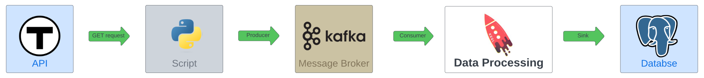

# Data Streaming

## Overview

This README provides a comprehensive overview of our data streaming procedure, utilized to retrieve and store data from the MBTA API. The process involves streaming data from the [MBTA API using the Server Sent Event protocol](https://www.mbta.com/developers/v3-api/streaming), capturing the JSON response, and subsequently forwarding this data to a Kafka topic. A consumer application actively monitors this Kafka topic and is responsible for writing the data into a PostgreSQL database.

Data Streaming Workflow
### 1. Continuous Data Retrieval from MBTA
- Initiation: A Python script initiates an SSE (Server-Sent Events) connection to MBTA's API.
- Authentication & Parameters: The script authenticates using API keys and specifies parameters to tailor the data feed.
Data Format: The MBTA API streams data in a JSON format, providing real-time updates on transit statuses.

### 2. Kafka Producer Integration
- Data Dispatch: The JSON data is sent to a predefined Kafka topic.
- Configuration: The Kafka producer is finely tuned for message serialization, error handling, and partitioning to ensure efficient data transmission.

### 3. Kafka Topic as a Buffer
Decoupling: Acts as a bridge between data sources (MBTA API) and consumers, ensuring system resilience.
Data Integrity: Guarantees that data is retained even in the event of downstream failures, preventing data loss.

### 4. Stream Processing with Kafka Consumer
- Real-time Processing: A Kafka consumer application continuously listens to the topic, ready for immediate data processing.
- Operations:
  - Data Transformation: Reformats data for compatibility with database storage and machine learning models.
  - Data Enrichment: Adds additional context or computations to the raw data, enhancing its value.

### 5. PostgreSQL Database Storage
- Data Storage: The enriched data is stored in a PostgreSQL database.
- Functionality: Beyond storage, the database supports querying capabilities for data analysis and machine learning model inputs.
