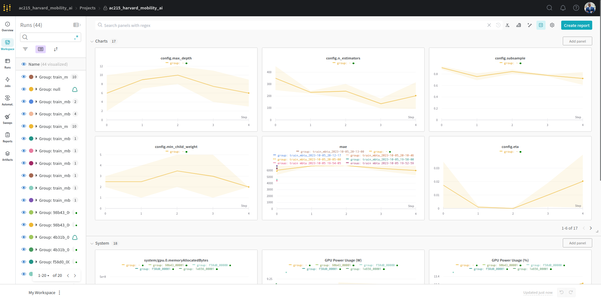

# Milestone 3: Building a Scalable and Modular Computing Infrastructure

## Introduction

1. **MS3 overview:** This milestone focuses on constructing a robust, scalable, and modular computing infrastructure. With an emphasis on adaptability, we've architected a system capable of seamless integration with a plethora of tools and cloud services.
1. **Team Members:** Kane Norman, Juan Castillo, Philip Ndikum, David Wintermeyer
1. **Group Name:** MBTArrivals
1. **Project:** Amidst growing difficulties in urban mobility and the need for timely transit predictions, our group project aims to build a scalable time series forecasting system for the Massachusetts Bay Transportation Authority (MBTA) transit system. By combining modern data engineering and scalable Machine Learning operations (MLOps) methodologies, this research aims to address pressing challenges in infrastructure and transit reliability -- with broader implications for supply-chain optimization and logistics. By providing guidelines and solutions, our project serves as an instructive blueprint, and a substantive contribution to the ever-growing data engineering and urban mobility literature.

## Architecture Highlights

1. **Distributed Computing and Cloud Storage Integration**:
    - Google Cloud Platform (GCP) Our primary cloud storage solution. By leveraging GCP, we can use a plethora of tools and services, including Google Colab Pro for expansive experimentation. Whilst wer selected GCP based on the markscheme, we tried to use platform agnostic tools and version controlled our code on Github to ensure our architecture isn't confined to one ecosystem or vendor, reflecting a broad, real-world approach where flexibility and scalability are paramount.
    - Data Pipeline: The design embodies robust extraction, transformation, and versioning capabilities. Examples of versioned datasets underline its effectiveness.
1. **Data Management**: While our current phase primarily harnesses tools outside the TensorFlow ecosystem, our architectural decisions leave the door open for seamless integration with TensorFlow's utilities (like TF Data and TF Records) in future iterations.We have a robust and flexible architecture which allows us to use different libraries and tools and scale out our end-to-end architecture.

## Machine Learning Workflow Implementation

Our advanced training workflows are meticulously designed to offer a robust yet flexible approach, ensuring both immediate results and long-term scalability. With evidence of successful training runs, in-depth experiment tracking, and provisions for multi-GPU/serverless training, this system is positioned to evolve with changing demands and technologies.

Furthermore, the production-grade design of our architecture affords flexibility. It's equipped to seamlessly transition between different server-less vendors, ensuring we're not tethered to a specific service. This scalability is vital as it allows for easy incorporation of enhanced data sources. Over the coming weeks, our exploration will extend to potentially integrating new data streams, such as web APIs, which could further enrich our analyses and forecasts.

### Key Files and Their Functions:

1. **gcp_dataloader.py**
   - **Purpose**: Enables seamless extraction and preprocessing of transit data directly from Google Cloud Platform buckets.
   - **Functions**:
     - `authenticate_gcp()`: Facilitates GCP authentication.
     - `extract_from_gcp()`: Initiates raw data retrieval via SQL operations.
     - `preprocess_data()`: Implements data preprocessing routines.

2. **delay_etl.py**
   - **Purpose**: Primarily engaged in transit data preprocessing, tailored for predicting bus delays.
   - **Functions**:
     - `create_date_features()`: Specialized feature engineering for date-time data.
     - `transform()`: ETL functions customized for delay-centric data.
     - `data_checks_and_cleaning()`: Ensures data integrity through sanitation and cleaning.

3. **ml_train.py**
   - **Purpose**: A central hub for GPU-optimized training, exhaustive model optimization, performance assessment, and model serialization.
   - **Functions**:
     - `compute_metrics_table()`: Produces a comprehensive metrics table suited for regression analysis.
     - `retrain_best_xgboost()`: Refines models post-tuning using the combined prowess of Ray and WandB.
     - `retrain_model_with_best_config()`
     - `train_mbta()`: Core functions dedicated to effective model training.

## Concluding Remarks

Our approach meets all requirements laid out in the Milestone 3 framework. We've forged a resilient and flexible architecture, ensuring we're poised to scale and adapt in forthcoming phases. As we look ahead, the upcoming milestones will see us delving into financial estimations concerning data quality control for the government. We are optimistic that our findings will foster tangible, positive impacts for citizens, extending beyond the confines of this project.

One of the highlights of our workflow is the monitoring and experiment tracking through the Weights and Biases (wandb) cloud platform. Below is a snapshot of the monitoring interface:

This platform provides real-time feedback on our training sessions, assisting in keeping our models optimized and efficient and will enable us to continue scaling out our efforts.
