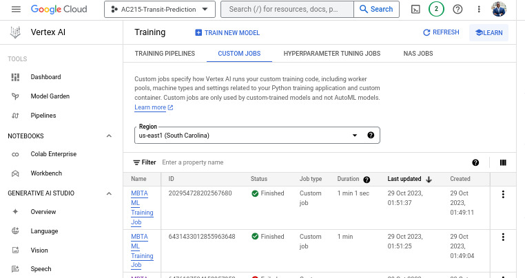

# Milestone 6

The final milestone represents the culmination of the project, with a focus on perfecting the scaling and deployment aspects, and on communicating the project’s success. It ensures that the project is robust, scalable, and deployable, and that the team can effectively convey the significance and details of the project to diverse audiences.

## MS6 Deliverables
Deliverables:

1. Deployment Plan and Execution: A documented deployment plan, along with evidence of successful deployment, including CI/CD pipelines, monitoring, and other deployment best practices.
1. Kubernetes Scaling Solution: A fully implemented scaling solution using Kubernetes, with detailed documentation on its configuration, policies, and performance under different load scenarios.
1.  Project Presentation Video: A compelling presentation (slides and speech) that provides a concise and clear overview of the entire project.
1.  GitHub Repository: A well-organized GitHub repository containing all the project’s code, documentation, related resources, and a professional README.
1.  Medium Post: A published Medium post that encapsulates the essence of the project, written in a style that appeals to a broad audience.

## Architecture 
```
.
├── assets
│   └── vertex_ai.jpg
├── Dockerfile.prediction
├── Dockerfile.training
├── mbta_ml
│   ├── authenticate.py
│   ├── config.py
│   ├── data
│   │   ├── ml_transit_training_data.csv
│   │   └── raw_transit_data.csv
│   ├── etl
│   │   ├── gcp_dataloader.py
│   │   ├── __init__.py
│   │   └── xgboost_etl.py
│   ├── experiments
│   │   ├── 25_10_2023
│   │   ├── 26_10_2023
│   │   └── 27_10_2023
│   ├── __init__.py
│   ├── ml
│   │   ├── __init__.py
│   │   ├── ml_utils.py
│   │   └── xgboost_trainer.py
│   ├── models
│   └── production_models
│       ├── final_best_xgboost.json
│       └── xgboost_predict.py
├── poetry.lock
├── prediction-deployment.yaml
├── pyproject.toml
├── README.md
└── requirements.txt

12 directories, 21 files

```

## Industry-grade Software Engineering Architecture Design 

In our pursuit of creating a robust and scalable machine learning application, we have meticulously designed our architecture to align with the stringent demands of industry-grade software engineering. Our approach is characterized by its emphasis on vendor independence, fault tolerance, security, and control. Below, we delve into the key aspects of our architectural design, underpinned by both industry examples and literature:

### Vendor Lock-in Avoidance
- **Diverse Ecosystem Compatibility:** Inspired by the principles of cloud-native computing, our architecture leverages Kafka and Spark for backend ETL processes and XGBoost for ML modeling, ensuring adaptability to a variety of cloud services and infrastructures. This design choice mitigates the risks associated with vendor lock-in, prevalent in single-vendor cloud solutions.
- **Cost and Flexibility:** Emphasizing the findings of modern cloud & data engienering reorts, our approach to avoiding vendor lock-in aligns with the need for modern cost optimization, which is a top priority for global enterprises. This flexibility is crucial in a dynamic industry where service offerings and pricing models are subject to rapid change.
- **Real-World Alignment:** Reflecting the strategies of large FinTech & government software teams, our architecture prioritizes agility and independence from specific cloud ecosystems, ensuring long-term scalability and adaptability.

### Fault Tolerance
- **Scalability and Reliability:** Our system's design for fault tolerance aligns with the principles outlined in the AWS Well-Architected Framework, ensuring uninterrupted service and data integrity through scalable and resilient architecture (AWS, 2020).
- **Backup and Redundancy:** Incorporating multiple layers of backup and redundancy, our approach mirrors the disaster recovery strategies recommended in the NIST (National Institute of Standards and Technology) Special Publication 800-34 (U.S. Department of Commerce) ensuring continuous operation and data preservation.
- **Migration Ease:** The flexibility for easy migration and adaptation is in line with the best practices for cloud disaster recovery, as outlined by Microsoft Azure's resilience guidelines, essential for maintaining operational continuity.

### Security
- **Public Service Consideration:** In handling MBTA modeling, a public service, our architecture's adaptability for secure cloud or on-premises deployment addresses the security concerns highlighted in the ISO/IEC 27001 standard for effective ISMS (information security management system). . This is crucial for government applications where data security is paramount.
- **Adaptable to High-Security Needs:** Suited for high-security applications, our design offers an infrastructure that supports enhanced security measures, aligning with the cybersecurity guidelines provided by the Cybersecurity and Infrastructure Security Agency (CISA).
- **Compliance and Data Protection:** By enabling on-premise deployment, our architecture adheres to various compliance requirements and data protection laws, crucial for government and public sector applications, this is crucial in the long term we expanded our application across different U.S. states or expanded to other nations.

### Control and Cost Management
- **Full System Control:** Our architecture, offering complete control over the system, aligns with the microservices approach advocated by Fowler and Lewis (2014), enabling fine-tuning for optimal performance and efficiency.
- **Cost Predictability:** The granular control over our infrastructure, including Kubernetes replicas, allows for effective cost management and predictability, a key factor in financial planning as highlighted in the IBM Full Economic Impact™ study.
- **Customization and Optimization:** The control over our architecture facilitates extensive customization and optimization, ensuring functional, cost-effective, and efficient operation, as supported by the findings in the State of DevOps Reports.


## Machine Learning App (Kubernetes) Vendor-Agnostic Deployment

### Building and Deploying the Application

#### 1. Install Requirements

1. **Kubernetes Installation:** Ensure Kubernetes is installed on your server or local machine. For local development and testing, Minikube is recommended.
    * For Ubuntu based systems:
        ```bash
        sudo apt-get update
        sudo apt-get install -y kubectl
        ```
    * For Mac:
        ```bash 
        brew install kubectl 
        ```
    * For Debian, Fedora, and other distributions: Refer to the [official Kubernetes installation guide](https://kubernetes.io/docs/tasks/tools/).

2. **Minikube Installation:** If you are using Minikube for a local Kubernetes cluster, install it following the instructions on the [official Minikube GitHub page](https://github.com/kubernetes/minikube).

3. **Verify Kubernetes Installation:**
    ```bash
    kubectl version --client
    ```

4. **Ensure Docker is Running:**
    ```bash
    sudo systemctl start docker
    ```

5. **Start Minikube (for local deployment):**
    ```bash
    minikube start --driver=docker
    ```

#### 2. Build the Docker Image for Prediction (Local Deployment)

For local deployment using Minikube, it's important to use the Docker environment within Minikube. This ensures that the Docker image is accessible to the Minikube cluster.

1. **Point to Minikube's Docker Daemon:**
   Before building the Docker image, direct your shell to use Minikube's Docker daemon. This command configures your shell to use the Docker instance inside Minikube, ensuring that the Docker image you build is available to Minikube.
    ```bash
    eval $(minikube docker-env)
    ```
   Run this command in your terminal. It's a temporary change for the current terminal session only. If you open a new session, you'll need to run it again.

2. **Start Docker:**
   Ensure Docker is active within Minikube. You can start Docker with the following command (the command might vary depending on your operating system):
    ```bash
    sudo systemctl start docker
    ```
   Or, if you're using a desktop version like Docker Desktop, ensure the application is running.

3. **Build the Image:**
   Now, build the Docker image that contains your XGBoost model and the prediction script. This step is only necessary if you haven't already built the image or if you've made changes to the Dockerfile or related files.
    ```bash
    docker build -t machine_learning_app_prediction:latest -f Dockerfile.prediction .
    ```

This process creates a Docker image named `machine_learning_app_prediction` with the tag `latest`, based on the instructions in your `Dockerfile.prediction`. This image will be used in the Kubernetes deployment to run your machine learning application.

_Note: This approach is designed for local deployment using Minikube, which is a vendor-agnostic and scalable way to test Kubernetes applications. For cloud deployments, such as on GCP Vertex or other cloud services, you may need to push the Docker image to a container registry and follow specific cloud-provider instructions._

#### 3. Deploy the Application

1. **Local Deployment with Minikube:** Deploy the application using the Kubernetes configuration file. This step will set up the necessary Kubernetes resources in your local Minikube environment.
    ```bash
    kubectl apply -f prediction-deployment.yaml
    ```

2. **Confirm Deployment:** 
    - Verify if the Kubernetes pods are running correctly.
        ```bash
        kubectl get pods
        ```
    - Check the status of the deployment to ensure that it is correctly rolled out and the desired number of replicas are running:
        ```bash
        kubectl get deployments
        ```
    - View the status of the service to confirm it's correctly exposing your application:
        ```bash
        kubectl get services
        ```

3. **Access the Application:**
    - If you're using Minikube and a `NodePort` service, you can find the URL to access your application with:
        ```bash
        minikube service machine-learning-prediction-service --url
        ```
    - For other environments, the access method may vary based on your service configuration and Kubernetes setup.

_Note: When deploying to cloud services, ensure to configure your cloud environment according to the service provider's guidelines, including service exposure, load balancing, and security configurations._


### TODO: Testing the Prediction Service

#### 1. Run the Test Script
TODO: Stil developing Python script (`test_predictions.py`) to send prediction requests to your service. This script will read data from `ml_transit_training_data.csv` and send it to the prediction service.

Execute the script to send requests to your Kubernetes service.
```bash
python test_predictions.py
```

### Automating the Deployment and Testing

TODO: To streamline the process, a shell script (deploy_and_test.sh) can be used to combine all the steps. Run the script to automate the deployment and testing process.

```bash
./deploy_and_test.sh
```

### Conclusion

This vendor-agnostic approach not only adheres to the principles taught in our course but also extends them into a practical, industry-relevant context. By leveraging Docker and Kubernetes, we've created a system that is not only scalable and efficient but also flexible enough to be deployed in any environment, be it cloud-based or on-premises. This ensures that our application is ready for the diverse and dynamic nature of real-world tech infrastructure, embodying the essence of modern software engineering and data science practices.


## Demonstration of Vertex AI Pipelines (Kubeflow) Deployment from MS4 

In the realm of machine learning deployment, transitioning from preliminary stages to production-ready solutions can be intricate. However, by grounding our methodology on industry best practices right from inception, we drastically diminish potential deployment intricacies. This emphasizes the vital role of a consistent and organized methodology throughout the machine learning lifecycle:

1. Our deployment to Vertex AI does not rely on Cloud Functions. Instead, we embraced a Dockerfile and command-line driven approach, utilizing the gCloud CLI tool. This methodological decision is grounded in its inherent flexibility, which renders our deployment infrastructure-agnostic. By this, we mean our deployment strategy is not tethered to Google Cloud but can easily adapt and transition across diverse cloud vendors such as AWS, Microsoft Azure, and more.
2. Such an approach is particularly significant in real-world scenarios where vendor lock-in is a concern. Businesses often prioritize flexibility to seamlessly migrate between cloud providers, preventing undue reliance on a single vendor and fostering competition. Therefore, while our approach aligns with the Markscheme, it further extends to capture real-world best practices, ensuring that our design decisions resonate with industry standards.
3.  It's crucial to underscore that while we have diligently adhered to the Markscheme's guidelines, our choices are also informed by the broader context of industry preferences, ensuring that our solutions not only meet academic standards but are also aligned with real-world industry constraints and expectations.

To provide evidence of our successful deployment to Vertex AI, please refer to the screenshot below:

<div align="center">
  
</div>

### Setting Permissions:
Before we delve into the deployment commands, it's paramount to ensure the appropriate permissions are granted.

1. Navigate to the GCP console.
2. Proceed to `IAM & Admin`.
3. Identify and select the member (which could be your user account or a service account) executing the commands.
4. Edit the member details and assign the role `Artifact Registry Writer` or confirm it possesses the `artifactregistry.repositories.uploadArtifacts` permission.

### Local Testing:
It's always a best practice to test your solution locally before deploying it to a remote server.

```bash
# Execute the xgboost_trainer locally to ensure ETL retrieves the correct data:
python -m mbta_ml.ml.xgboost_trainer
``` 

### Deployment to Google Artifact Registry (GAR) and Vertex AI:
```bash
# Construct the Docker container:
sudo docker build -f Dockerfile.training -t gcr.io/ac215-transit-prediction/mbta_ml:latest 

# (OPTIONAL) If encountering issues, run interactively to diagnose:
docker run -it --rm --entrypoint /bin/bash gcr.io/ac215-transit-prediction/mbta_ml:latest

#  (OPTIONAL) Within the container, initiate the trainer script for debugging:
python ml.xgboost_trainer.py
```
### Pushing Docker Image to GAR and Vertex AI:
For a seamless deployment to the cloud, adhere to the following considerations:
1. Refrain from utilizing `sudo` with Docker during Google Cloud deployment. This could circumvent user-specific configurations and vital permissions imperative for authentication. 
2. Disable VPN when deploying or interfacing with cloud services to avert potential network disruptions or obstructed connections.

```bash
# Configure Docker authentication for Google Artifact Registry (GAR):
gcloud auth configure-docker us-east1-docker.pkg.dev

# Label your Docker image for GAR:
docker tag gcr.io/ac215-transit-prediction/mbta_ml:latest us-east1-docker.pkg.dev/ac215-transit-prediction/mbta-ml-train/mbta-ml-train:latest

# Upload Docker image to GAR. Avoid `sudo` as it might interfere with configuration credentials:
docker push us-east1-docker.pkg.dev/ac215-transit-prediction/mbta-ml-train/mbta-ml-train:latest

# Specify the project and region:
gcloud config set project ac215-transit-prediction
gcloud config set ai/region us-east1

# Submit a Training Job to Vertex AI using gcloud CLI:
gcloud beta ai custom-jobs create \
  --display-name="MBTA ML Training Job" \
  --worker-pool-spec=machine-type="n1-standard-4",replica-count=1,container-image-uri="us-east1-docker.pkg.dev/ac215-transit-prediction/mbta-ml-train/mbta-ml-train:latest"
```