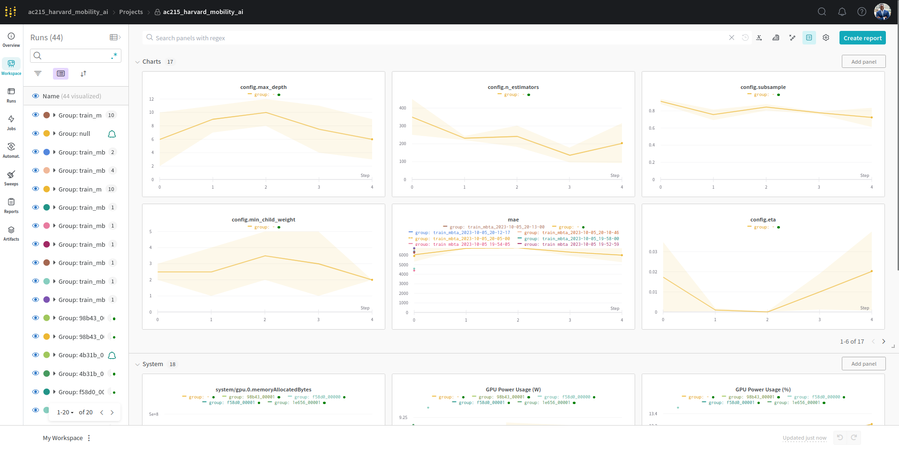

# AC215 - Milestone2


**Table of Contents**

- [Introduction](#introduction)
- [Micro Service Descriptions](#micro-service-descriptions)
  - [Zookeeper](#zookeeper)
  - [Broker1, Broker2, Broker3](#brokers)
  - [Schema-Registry](#schema-registry)
  - [Control-Center](#control-center)
  - [Producer](#producer)
  - [Consumer](#consumer)
  - [Flask App](#flask-app)
  - [Flask Database](#flask-database)
- [Project Organization](#project-organization)
- [Running Locally](#running-locally)
- [Architecture Highlights](#architecture-highlights)
- [Machine Learning Workflow Implementation](#machine-learning-workflow-implementation)
- [Key Files and Their Functions](#key-files-and-their-functions)
- [Concluding Remarks](#concluding-remarks)

## Introduction

1. **Team Members:** Kane Norman, Juan Castillo, Philip Ndikum, David Wintermeyer
1. **Group Name:** MBTArrivals
1. **Project:** Amidst growing difficulties in urban mobility and the need for timely transit predictions, our group project aims to build a scalable prediction system for the Massachusetts Bay Transportation Authority (MBTA) transit system. By combining modern data engineering and scalable Machine Learning operations (MLOps) methodologies, this research aims to address pressing challenges in infrastructure and transit reliability -- with broader implications for supply-chain optimization and logistics. By providing guidelines and solutions, our project serves as an instructive blueprint, and a substantive contribution to the ever-growing data engineering and urban mobility literature.

**Team Members**
Kane Norman, Juan Castillo, Philip Ndikum, David Wintermeyer

**Group Name**
MBTArrivals

**Project**
Amidst growing difficulties in urban mobility and the need for timely transit predictions, our
group project aims to build a scalable time series forecasting system for the Massachusetts
Bay Transportation Authority (MBTA) transit system. By combining modern data engineering and scalable Machine Learning operations (MLOps) methodologies, this research aims to address pressing challenges in infrastructure and transit reliability -- with broader implications for supply-chain optimization and logistics. By providing guidelines and solutions, our project serves as an instructive blueprint, and a substantive contribution to the ever-growing data engineering and urban mobility literature.

### Micro Service Descriptions

In this project, we implement a microservice architecture where each service is containerized using Docker
and orchestrated via a `docker-compose.yml` file. Here's an overview of the services:

#### Zookeeper

Zookeeper is a crucial distributed coordination service that plays a vital role in managing distributed systems.
In this project, it is primarily utilized within the Apache Kafka ecosystem for tasks such as maintaining configuration information,
ensuring distributed synchronization, and providing a naming service.

#### Broker1, Broker2, Broker3

Brokers serve as the backbone of a Kafka infrastructure. They are responsible for receiving messages from producers,
securely storing these messages, and efficiently delivering them to consumers. We employ multiple broker instances within our Kafka cluster for redundancy
to ensure fault tolerance and scalability -- enhancing the robustness of our system.

#### Schema-Registry

The Schema Registry service is integral to our data pipeline, enabling the storage and management of Avro schemas
associated with Kafka topics. Its primary function is to ensure data consistency and compatibility between producers and consumers --
facilitating the seamless exchange of information within our architecture.

#### Control-Center

The Control Center is an indispensable tool for managing and monitoring Apache Kafka clusters.
It provides valuable insights into the health and performance of our Kafka infrastructure, helping us maintain a
resilient and responsive messaging system.

#### Producer

The Producer service is responsible for generating and dispatching messages to Kafka topics.
Its primary data source is the [mbta-v3-api](https://www.mbta.com/developers/v3-api), which supports real-time data streaming
through Server Sent Events (SSE). This service is pivotal in ensuring that fresh data is continuously ingested into our system.
The bulk of this code can be found in the `/data_streaming/kafka_producer` directory.

#### Consumer

The Consumer service plays a vital role in processing messages from Kafka topics. It leverages the power of
[Spark Structured Streaming](https://spark.apache.org/docs/latest/structured-streaming-kafka-integration.html)
to efficiently extract and process data from Kafka. This enables us to perform complex data transformations and analytics,
driving our data-driven decision-making processes.
The bulk of this code can be found in the `/data_streaming/kafka_consumer` directory.

#### Flask App

Our Flask App is the user-facing component of our system, built using the Flask web framework.
We employ Flask's Jinja2 templating framework for the frontend, while Bluma CSS handles our CSS styling.
This combination ensures an interactive and visually appealing web interface for our users, enhancing their overall experience.
The bulk of this code can be found in the `/flask_app/app` directory.

#### Flask Database

The Flask Database service is a PostgreSQL database at the core of our data storage and retrieval system.
To facilitate spatial data processing, we have integrated the PostGIS extension into our database.
This extension enables us to handle spatial data effectively, a critical requirement for our predictive models and geospatial applications.
The bulk of this code can be found in the `/postgres` and `/flask_app/app/views` directories.

In the future, once our model is developed, we will make an API endpoint for the model and run it as a separate microservice.

## Project Organization

```
├── LICENSE
├── README.md
├── SETUP_INSTRUCTIONS.md
├── assets
│   └── figures
│       ├── data-streaming.svg
│       ├── high-level.svg
│       ├── mobility_ai_logo.png
│       ├── wanddb_monitoring.pdf
│       └── wanddb_monitoring.png
├── data_streaming
│   ├── README.md
│   ├── kafka_consumer
│   │   ├── Dockerfile
│   │   ├── __init__.py
│   │   ├── consumer.py
│   │   ├── schemas
│   │   │   ├── __init__.py
│   │   │   ├── alerts.py
│   │   │   ├── schedules.py
│   │   │   ├── shapes.py
│   │   │   ├── stops.py
│   │   │   ├── trips.py
│   │   │   └── vehicles.py
│   │   └── utils
│   │       ├── __init__.py
│   │       ├── config.py
│   │       └── spark_functions.py
│   └── kafka_producer
│       ├── Dockerfile
│       ├── __init__.py
│       ├── config.py
│       └── producer.py
├── dev-requirements.txt
├── docker-compose.yml
├── flask_app
│   ├── Dockerfile
│   └── app
│       ├── __init__.py
│       ├── config
│       │   ├── __init__.py
│       │   └── config.py
│       ├── extensions.py
│       ├── models
│       │   ├── __init__.py
│       │   ├── alert.py
│       │   ├── schedule.py
│       │   ├── shape.py
│       │   ├── stop.py
│       │   └── trip.py
│       ├── static
│       │   ├── images
│       │   │   └── train-icon.png
│       │   └── js
│       │       ├── index.js
│       │       └── stops.js
│       ├── templates
│       │   └── index.html
│       └── views.py
├── machine_learning
│   ├── delay_etl.py
│   ├── gcp_dataloader.py
│   ├── milestone_3_readme.md
│   └── ml_train.py
├── milestone_submissions
│   ├── README.md
│   └── milestone2
├── postgres
│   ├── Dockerfile
│   └── db
│       └── init.sql
├── pytest.ini
├── requirements.txt
└── tests
    ├── __init__.py
    ├── kafka_consumer_utils_spark_functions_test.py
    └── kafka_producer_configs_test.py
```

### Running Locally

1. **Clone the Repository**:

   ```bash
   git clone https://github.com/kanenorman/AC215_MBTArrivals-App.git
   cd AC215_MBTArrivals-App
   ```

1. **Request an API Token**:

   - Visit the [MBTA's official site](https://www.mbta.com/developers/v3-api) or the relevant link to get your API token.

1. **Set Up Your Environment**:

   - Create a local `.env` file in the project directory.
   - Populate the `.env` file with necessary configurations, including your MBTA API Token.

   ** Example: `.env` file **
   This section lists the configuration variables used in the project along with corresponding values.

   ```bash
    # kafka & zookeeper
    KAFKA_HOST1=broker1
    KAFKA_PORT1=9092
    KAFKA_HOST2=broker2
    KAFKA_PORT2=19092
    KAFKA_HOST3=broker3
    KAFKA_PORT3=29092
    ZOOKEEPER_PORT=2181

    # API keys
    MBTA_API_KEY= [Your_key]

    # Postgres
    POSTGRES_PORT=5432
    POSTGRES_DB=mbta
    POSTGRES_USER=postgres
    POSTGRES_PASSWORD=password
    POSTGRES_HOST=flask_database
    POSTGRES_DRIVER=org.postgresql.Driver

    # Flask
    FLASK_PORT=5000

   #W&B
   WANDB_API_KEY=[Your_key]
   ```

1. **Set up Python Version using Pyenv**:

   - If you haven't installed `pyenv` yet, you can do so by following the instructions on [pyenv's GitHub repository](https://github.com/pyenv/pyenv#installation).
   - Install the required Python version:
     ```bash
     pyenv install 3.10.0
     pyenv local 3.10.0
     ```
   - Verify the activated Python version:
     ```bash
     python --version
     ```

1. **Set up and Activate Conda Environment**:

   - Create and activate a new Conda environment named "mbta_env" with Python 3.10 and install requirements:
     ```bash
     conda config --add channels conda-forge # Ensure extra channels added
     conda create --name mbta_env python=3.10
     conda activate mbta_env
     pip install -r requirements.txt
     ```

1. **Ensure Docker is Running (For Docker Users)**:

   ```bash
   sudo systemctl start docker
   sudo systemctl status docker
   ```

1. **Run the App with Docker**:

   ```bash
   docker-compose up -d
   ```

1. **Access the App**:
   - Open a web browser and navigate to `localhost:5000`.

## Milestone 3: Building a Scalable and Modular Computing Infrastructure

1. **MS3 overview:** This milestone focuses on constructing a robust, scalable, and modular computing infrastructure. With an emphasis on adaptability, we've architected a system capable of seamless integration with a plethora of tools and cloud services.

## Architecture Highlights

1. **Distributed Computing and Cloud Storage Integration**:
   - Google Cloud Platform (GCP) Our primary cloud storage solution. By leveraging GCP, we can use a plethora of tools and services, including Google Colab Pro for expansive experimentation. Whilst we selected GCP based on the deliverable objectives, we tried to use platform agnostic tools and version controlled our code on Github to ensure our architecture isn't confined to one ecosystem or vendor, reflecting a broad, real-world approach where flexibility and scalability are paramount.
   - Data Pipeline: The design embodies robust extraction, transformation, and versioning capabilities. Examples of versioned datasets underline its effectiveness.
1. **Data Management**: While our current phase primarily harnesses tools outside the TensorFlow ecosystem, our architectural decisions leave the door open for seamless integration with TensorFlow's utilities (like TF Data and TF Records) in future iterations. With regard to the current milestone, we decided against leveraging TF Data and Records since we are working with a small subset of data that can be run locally. As we expand our dataset, we will implement TF Data and Records if the dataset grows in size to the point where it would be beneficial. By design, we have a robust and flexible architecture allowing us to use different libraries and tools to scale out our end-to-end architecture.

## Machine Learning Workflow Implementation

Our advanced training workflows are meticulously designed to offer a robust yet flexible approach, ensuring both immediate results and long-term scalability. With evidence of successful training runs, in-depth experiment tracking, and provisions for multi-GPU/serverless training, this system is positioned to evolve with changing demands and technologies.

Furthermore, the production-grade design of our architecture affords flexibility. It's equipped to seamlessly transition between different server-less vendors, ensuring we're not tethered to a specific service. This scalability is vital as it allows for easy incorporation of enhanced data sources. Over the coming weeks, our exploration will extend to potentially integrating new data streams, such as web APIs, which could further enrich our analyses and forecasts.

### Key Files and Their Functions

1. **gcp_dataloader.py**

   - **Purpose**: Enables seamless extraction and preprocessing of transit data directly from Google Cloud Platform buckets.
   - **Functions**:
     - `authenticate_gcp()`: Facilitates GCP authentication.
     - `extract_from_gcp()`: Initiates raw data retrieval via SQL operations.
     - `preprocess_data()`: Implements data preprocessing routines.

2. **delay_etl.py**

   - **Purpose**: Primarily engaged in transit data preprocessing, tailored for predicting bus delays.
   - **Functions**:
     - `create_date_features()`: Specialized feature engineering for date-time data.
     - `transform()`: ETL functions customized for delay-centric data.
     - `data_checks_and_cleaning()`: Ensures data integrity through sanitization and cleaning.

3. **ml_train.py**
   - **Purpose**: A central hub for GPU-optimized training, exhaustive model optimization, performance assessment, and model serialization.
   - **Functions**:
     - `compute_metrics_table()`: Produces a comprehensive metrics table suited for regression analysis.
     - `retrain_best_xgboost()`: Refines models post-tuning using the combined prowess of Ray and WandB.
     - `retrain_model_with_best_config()`
     - `train_mbta()`: Core functions dedicated to effective model training.

## Concluding Remarks

Our approach meets all requirements laid out in the Milestone 3 framework. We've forged a resilient and flexible architecture, ensuring we're poised to scale and adapt in forthcoming phases. As we look ahead, the upcoming milestones will see us delving into financial estimations concerning data quality control for the government and integrating additional data to increase the robustness and accuracy of our predictions. We are optimistic that our findings has the potential to foster tangible, positive impacts for commuters, extending beyond the confines of this project.

One important feature of our workflow is monitoring and experiment tracking through the Weights and Biases (wandb) cloud platform. Below is a snapshot of the monitoring interface:



This platform provides real-time feedback on our training sessions, assisting in keeping our models optimized and efficient -- which will facilitate scaling out our prediction system.
