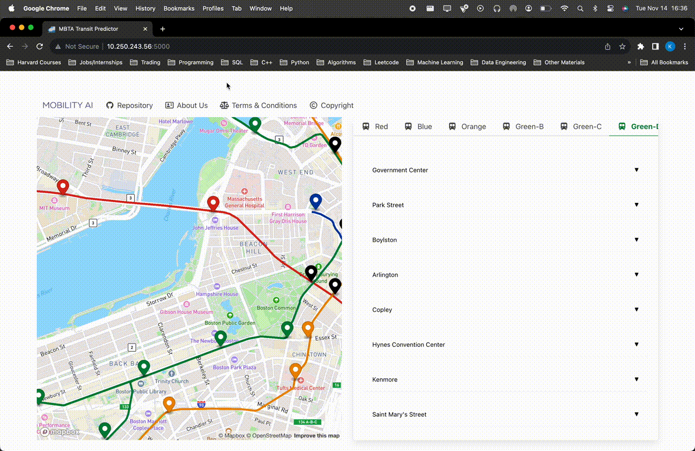

# Milestone 5

## Project Organization

```
.
├── assets
│   ├── architecture
│   │   ├── kafka-producer.svg
│   │   └── kafka-stream.svg
│   └── figures
│       ├── data-streaming.svg
│       ├── high-level.svg
│       ├── mobility_ai_logo.png
│       ├── wanddb_monitoring.pdf
│       └── wanddb_monitoring.png
├── data_streaming
│   ├── kafka_producer
│   │   ├── config.py
│   │   ├── Dockerfile
│   │   ├── __init__.py
│   │   ├── producer.py
│   │   └── README.md
│   ├── kafka_streams
│   │   ├── kafka-connect-jdbc
│   │   │   └── build_connectors.sh
│   │   ├── ksqldb-server
│   │   │   └── queries.sql
│   │   └── README.md
│   └── README.md
├── dev-requirements.txt
├── docker-compose.yml
├── flask_app
│   ├── app
│   │   ├── config
│   │   │   ├── config.py
│   │   │   └── __init__.py
│   │   ├── extensions.py
│   │   ├── __init__.py
│   │   ├── models
│   │   │   ├── __init__.py
│   │   │   ├── location.py
│   │   │   ├── route.py
│   │   │   ├── scheduled_arrival.py
│   │   │   ├── schedule.py
│   │   │   ├── stop.py
│   │   │   ├── trip.py
│   │   │   └── vehicle.py
│   │   ├── static
│   │   │   ├── about.txt
│   │   │   ├── android-chrome-192x192.png
│   │   │   ├── android-chrome-512x512.png
│   │   │   ├── apple-touch-icon.png
│   │   │   ├── css
│   │   │   │   └── styles.css
│   │   │   ├── favicon-16x16.png
│   │   │   ├── favicon-32x32.png
│   │   │   ├── favicon.ico
│   │   │   ├── images
│   │   │   │   ├── mobility_ai_logo.png
│   │   │   │   └── train-icon.png
│   │   │   ├── js
│   │   │   │   ├── index.js
│   │   │   │   └── stops.js
│   │   │   └── site.webmanifest
│   │   ├── templates
│   │   │   ├── about.html
│   │   │   ├── base.html
│   │   │   ├── copyright.html
│   │   │   ├── index.html
│   │   │   ├── navigation.html
│   │   │   └── terms.html
│   │   └── views.py
│   └── Dockerfile
├── LICENSE
├── machine_learning_app
│   ├── assets
│   │   └── vertex_ai.jpg
│   ├── Dockerfile.training
│   ├── mbta_ml
│   │   ├── authenticate.py
│   │   ├── config.py
│   │   ├── data
│   │   │   ├── ml_transit_training_data.csv
│   │   │   └── raw_transit_data.csv
│   │   ├── etl
│   │   │   ├── gcp_dataloader.py
│   │   │   └── __init__.py
│   │   ├── experiments
│   │   │   ├── 25_10_2023
│   │   │   ├── 26_10_2023
│   │   │   └── 27_10_2023
│   │   ├── ml
│   │   │   ├── __init__.py
│   │   │   ├── ml_utils.py
│   │   │   └── xgboost_trainer.py
│   │   ├── models
│   │   ├── production_models
│   │   │   └── final_best_xgboost.json
│   │   └── README.md
│   ├── poetry.lock
│   ├── pyproject.toml
│   ├── README.md
│   └── requirements.txt
├── milestone_submissions
│   ├── README.md
│   └── vertex_ai.jpg
├── postgres
│   ├── db
│   │   └── init.sql
│   └── Dockerfile
├── pytest.ini
├── README.md
├── requirements.txt
├── SETUP_INSTRUCTIONS.md
└── tests
    ├── __init__.py
    └── kafka_producer_configs_test.py

```

## App Design, Setup, and Code Organization

In designing the architecture of our application, we have meticulously embraced a microservices-based approach, a decision rooted in industry best practices for scalable, robust software engineering. This approach is not only about achieving modularity but also about ensuring future scalability, vital for real-world applications. Our code organization is structured with an acute emphasis on maintainability and clarity, aligning with the highest standards of software engineering and the milestone markschemes.



- **Kafka Producer**: Implementing a Kafka Producer to initiate data ingestion represents a strategic choice for efficient data stream management. This component efficiently channels data streams to Kafka Message Brokers, exemplifying a modern approach to handling large volumes of data in real-time applications.
- **Kafka Message Broker**: The Kafka Message Broker is the backbone of our architecture. It adeptly manages data flow between components, ensuring both robustness and scalability. This choice underpins our commitment to building a system that can handle high throughput and low latency, essential for large-scale, real-time data processing.
- **Data Processing to PostgreSQL**: Our utilization of PostgreSQL for data processing and storage aligns with industry norms for reliable and effective data management. This setup ensures high performance, particularly in handling complex queries and vast datasets.
- **FlaskSQLAlchemy Integration**: The integration of FlaskSQLAlchemy is a testament to our dedication to seamless interaction between our Flask applications and the PostgreSQL database. This ORM (Object-Relational Mapping) tool simplifies database transactions, enhancing the efficiency and reliability of our data operations.
- **Flask with MapBox and Google Client**: Enriching our Flask application with dynamic data visualization tools such as MapBox and Google Client showcases our focus on creating an interactive and user-friendly frontend. These tools elevate the user experience, providing intuitive and informative data visualizations.
- **FastAPI for Model Serving**: Employing FastAPI for model serving aligns with contemporary practices for API development. This framework is known for its high performance and ease of use, making it an ideal choice for exposing our XGBoost model through a RESTful API, thereby ensuring streamlined communication across services.
- **XGBoost Model on Google Vertex AI**: Hosting our XGBoost model on Google Vertex AI aligns with the markscheme and demonstrates the utilization of modern cloud tools. This setup benefits from Kubernetes-powered autoscaling, ensuring that our machine learning model is both efficient and scalable, ready to handle varying loads with ease. It is important to note that our architecture is flexible to prevent vendor lock-in and increasing cloud costs, as we could host our applications with an "on-premise" infrastructure avoiding expensive Google costs. To adhere to the markscheme for milestone 6 we will integrate using Vertex AI but it is important to note we have factored in real-world industrial considerations.
- **API Development**: Our focus on developing robust APIs using FastAPI and Flask is a reflection of our commitment to effective backend-frontend communication. This is crucial for creating a seamless and responsive user experience, vital for modern web applications.
- **Frontend Design**: The intuitive and responsive design of our frontend, integrated seamlessly with backend APIs, ensures real-time data interactions. This approach to frontend design reflects a deep understanding of user needs and industry trends, prioritizing accessibility and responsiveness.
- **User Interface**: The integration of MapBox and Google Client within the user interface offers an interactive and informative user experience. This aspect of our project not only enhances user engagement but also serves as a model for effective data presentation in web applications.


Our architecture's flexibility and scalability make it suitable not just for the MBTA in Boston but also for potential expansion across America. The robustness of our design ensures that our state-of-the-art architecture can be scaled and adapted to various scenarios, making it an exemplary model in the realm of real-time data processing and visualization applications.

## Deployment Strategy and CI/CD

As an alternative to using Ansible as suggested by the markscheme, we plan on using GitHub Actions for our Continuous Integration and Continuous Deployment (CI/CD) pipeline, complemented by deployment on Google Cloud Platform (GCP) (MS6 Requirement). This strategic decision was driven by the desire to align with industry best practices, which increasingly favor the use of integrated CI/CD tools and cloud-native solutions for deployment. GitHub Actions provide a powerful, flexible, and developer-friendly environment for automating software workflows, directly within our code repository ecosystem. Coupled with GCP's scalable and reliable infrastructure, this approach not only meets but exceeds the robustness and efficiency requirements of modern application deployment strategies.

- **GitHub Actions & GitHub for CI/CD**: Leveraging these tools allowed us to automate our software development processes, from testing to deployment, within the GitHub ecosystem.
- **GCP Deployment**: Utilizing the robust and scalable infrastructure of Google Cloud Platform enabled us to achieve a high level of efficiency and reliability in our application deployment.
- **Streamlined Deployment Process**: Our CI/CD pipeline, built around GitHub Actions and GCP, ensures consistent and efficient deployment, enabling swift rollouts of updates and improvements, while maintaining high standards of security and compliance.

Our `docker-compose.yml` contains all the instructions required to deploy our application:

- **Zookeeper Service**: Uses the `confluentinc/cp-zookeeper:7.5.0` image, with the specified port and environment variables. It includes a health check using nc (netcat).
- **Kafka Brokers (broker1, broker2, broker3)**: Each broker uses the `confluentinc/cp-kafka:7.5.0` image. They are configured with individual broker IDs, Zookeeper connection settings, listener settings, and health checks. They depend on the Zookeeper service being healthy.
- **Schema Registry**: Utilizes the `confluentinc/cp-schema-registry:7.5.0` image and depends on the Kafka brokers and Kafka Connect service (`connect`) being healthy. It exposes port 8081 and is configured with environment variables for Kafka and schema registry settings.
- **Kafka Connect**: Based on `confluentinc/cp-kafka-connect:7.5.0`, this service depends on the Kafka brokers and a `flask_database` service. It exposes port 8083 and includes various Kafka Connect configurations, a volume mount for Kafka Connect JDBC, and a health check.
- **Sink Connectors**: Uses the `curlimages/curl:8.4.0` image, depending on `flask_database` and `connect`. It runs a script for building connectors.
- **Control Center**: Utilizes `confluentinc/cp-enterprise-control-center:7.5.0`, depending on Kafka brokers and `ksqldb-server`. It exposes port 9021 and is configured with various environment variables related to Kafka, Connect, KSQL, and schema registry.
- **Producer**: A custom service built from a Dockerfile in `./data_streaming/kafka_producer/Dockerfile`. It depends on Kafka brokers and includes environment variables for Kafka and an API key.
- **KSQLDB Server and CLI**: Both use Confluent's ksqlDB images (`confluentinc/ksqldb-server:0.29.0` and `confluentinc/ksqldb-cli:0.29.0`). The server exposes port 8088 and is configured with various KSQL settings, including a volume for SQL queries. The CLI depends on the server and Kafka brokers.
- **Flask App**: A custom service built from a Dockerfile in `./flask_app/Dockerfile`. It exposes a specified Flask port and depends on the `flask_database` service. It includes environment variables for database URI and others.
- **Flask Database**: Built from a Dockerfile in `./postgres/Dockerfile`. It exposes a specified PostgreSQL port and is configured with PostgreSQL environment variables. It includes a volume for data persistence and a health check.
- **PgAdmin**: Based on `dpage/pgadmin4`, it depends on the `flask_database` service, exposes port 5050, and is configured with PGAdmin default email and password.
- **The entire deployment is organized within a custom network named `network`**, and a volume named `postgres_data` is defined for database persistence. This setup implies a sophisticated and integrated environment, primarily focused on Kafka-based data processing and management, with Flask serving as the web framework.

## Backend Data Infrastructure to Front Flask App Connections

Our team has meticulously designed and implemented a robust backend-to-frontend infrastructure within our Flask application. This architecture is strategically developed to ensure an efficient and seamless flow of data from Kafka streams to our PostgreSQL database, and ultimately to the frontend UI. Full set-up instructions are shown in `SETUP_INSTRUCTIONS.md`. The following table provides a detailed summary of the integral components and their specific roles:

| Component                        | Description                                                                                                                                                                                                                                                                                                                                          |
| -------------------------------- | ---------------------------------------------------------------------------------------------------------------------------------------------------------------------------------------------------------------------------------------------------------------------------------------------------------------------------------------------------- |
| **Models Directory**             | Hosts the definitions of our data models, which are directly mapped to database tables via FlaskSQLAlchemy. Key files include location.py, route.py, scheduled_arrival.py, schedule.py, stop.py, trip.py, and vehicle.py. They structure the data received from Kafka and stored in our PostgreSQL database.                                         |
| **views.py**                     | Central to defining route configurations for our Flask application, acting as a gateway for data requests and responses. It facilitates the interaction between the frontend and Flask backend, including routes for data retrieval and handling updates from Kafka. The index route renders the homepage with train schedules and stop information. |
| **extensions.py**                | Contains the FlaskSQLAlchemy extension, crucial for database operations. This extension is used for all database interactions.                                                                                                                                                                                                                       |
| **Dockerfile**                   | Outlines the containerization strategy for our Flask application. It provides insight into the runtime environment, especially highlighting the use of Python 3.10 and the port exposure for the Flask app.                                                                                                                                          |
| **init.py in the App Directory** | Serves as the entry point for creating and configuring the Flask application. It initializes and registers the Flask app, database, and routes, sets the app environment, and ensures database tables are created awt startup.                                                                                                                       |
| **Data Flow Overview**           | Data ingested by our Kafka producer is sent to Kafka topics and then consumed by our service. The consumed data is processed and stored in the PostgreSQL database using the structures defined in our models directory. Data is retrieved from the database through routes in views.py for the frontend, ensuring an interactive user interface.    |

## Conclusion

### Adherence to Industry-Grade Practices

- **Commitment to Excellence**: We have meticulously adhered to industry-grade practices, emphasizing efficiency, robustness, and scalability in our application development.
- **Technological Integration**: Our choices to integrate Kafka, Flask, and XGBoost demonstrate our commitment to delivering a scalable and user-centric solution.
- **Strategic Utilization of Tools**: Leveraging Google Cloud Platform and GitHub Actions for CI/CD underlines our alignment with modern software development practices and the markscheme objectives.

### Forward-Thinking Framework

- **Beyond Immediate Requirements**: Our approach has created a framework that is adaptable to future technological advancements and evolving user needs.
- **Resilience and Scalability**: The modularity of our architecture, combined with cutting-edge tools, ensures scalability and resilience.

### Preparing for Milestone 6

- **Integration of Machine Learning**: We are poised to integrate our machine learning application with our robust backend architecture in Milestone 6.
- **Strategic Use of Vertex AI**: Aligning with the markscheme, we will utilize Google Cloud's Vertex AI for our XGBoost model, embracing cloud-native technologies and enabling auto-scaling to Kubernetes.
- **Industry Best Practices**: This decision exemplifies our commitment to adopting industry best practices, ensuring our deployment is both academically compliant and industry-relevant.
- **Streaming and Predictive Inference**: Achieving accurate inference in streaming pipelines can be challenging, demanding expertise in both streaming and machine learning inference. This expertise is essential to minimize latency and develop applications that offer genuine utility to end-users while avoiding excessive latency or performance degradation to the point of unusability. Apache offers several powerful streaming platforms that excel in the field of ML streaming. Notably, Spark's support for structured streaming and Kafka stand out as excellent options.

### Balancing Academic and Industry Standards

- **Academic and Industry Relevance**: Our project journey balances academic criteria with industry best practices, ensuring relevance and future-proofing.
- **Excitement for Integration**: The upcoming integration of our data infrastructure, frontend, and the Vertex AI model on GCP in Milestone 6 marks a significant step towards building a state-of-the-art application.

In summary, our project is a testament to achieving a harmonious balance between academic requirements and industry standards, positioning us for success in both realms. We eagerly anticipate the integration and advancements in Milestone 6, showcasing our commitment to excellence in application development.
